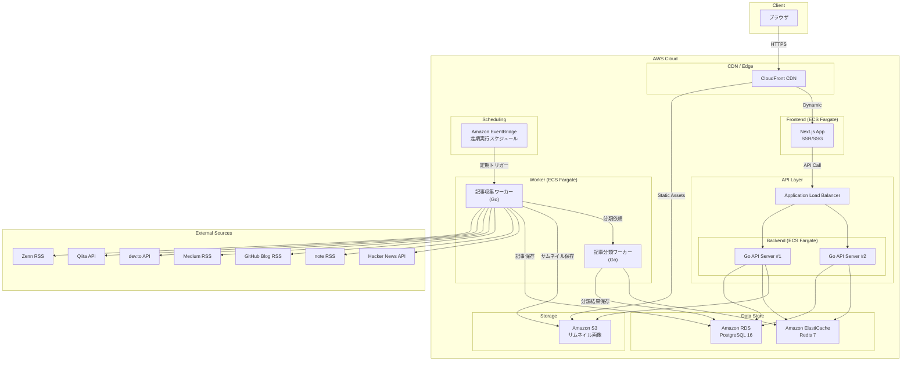
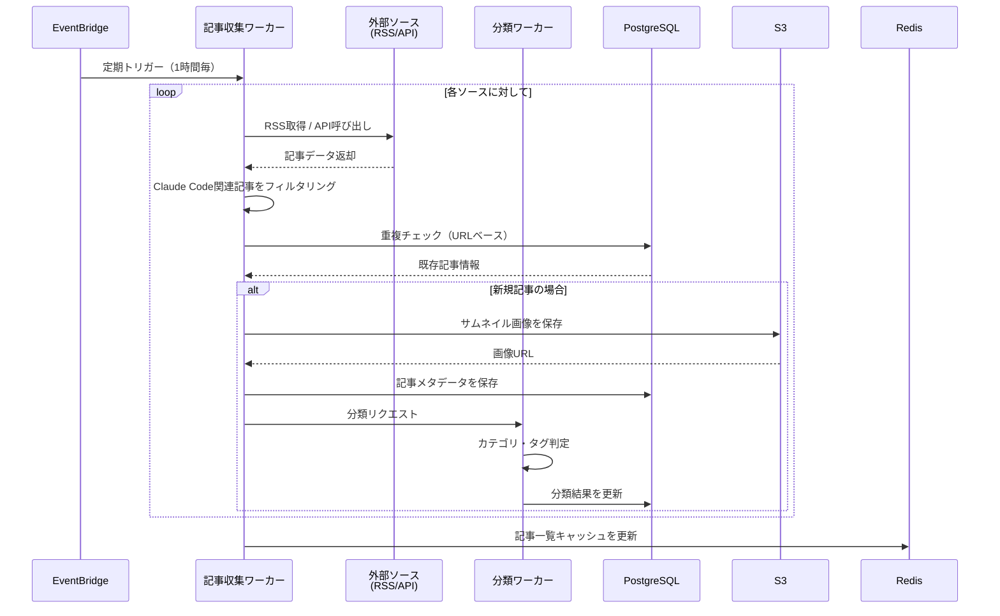
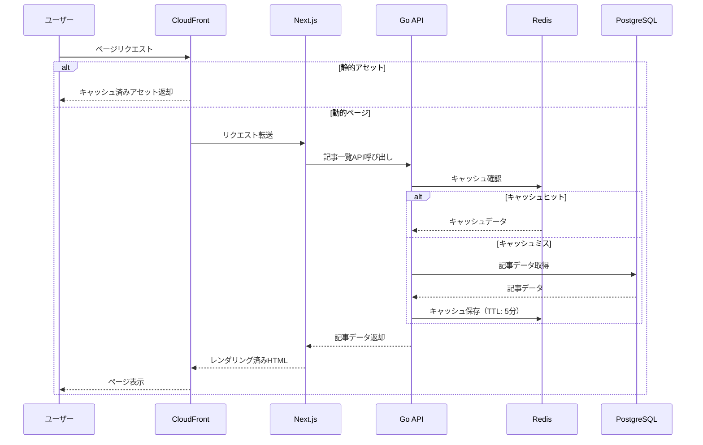

# ClaudeCode記事プラットフォーム - アーキテクチャ設計書

## 1. システム概要

### 目的
Claude Codeに関する最新技術記事（リンク・サムネイル）を自動収集・集約し、開発者が一箇所で効率的に情報収集できる専用プラットフォームを構築する。

### 主要機能
- **記事自動収集**: RSS/Web スクレイピングによる Claude Code 関連記事の定期収集
- **記事一覧表示**: サムネイル・タイトル・概要・ソース付きのカード形式表示
- **検索・フィルタリング**: キーワード検索、ソース別・日付別フィルタ
- **タグ分類**: 記事の自動カテゴリ分類（入門、Tips、比較、アップデート等）
- **トレンド表示**: 人気記事・最新記事のランキング
- **ブックマーク**: ユーザーごとのお気に入り記事保存

---

## 2. 技術スタック

| レイヤー | 技術 | バージョン | 用途 |
|---------|------|-----------|------|
| Frontend | Next.js | 15.x | SSR/SSG対応Reactフレームワーク |
| UI Components | shadcn/ui | latest | アクセシブルなUIコンポーネント |
| CSS | Tailwind CSS | 4.x | ユーティリティファーストCSS |
| Backend API | Go | 1.23+ | 高パフォーマンスAPIサーバー |
| Web Framework | Echo | v4 | 軽量Goウェブフレームワーク |
| Database | PostgreSQL | 16 | メインデータストア |
| Cache | Redis | 7.x | キャッシュ・セッション管理 |
| Infra | AWS | - | クラウドインフラ |
| Container | Docker | - | コンテナ化 |
| CI/CD | GitHub Actions | - | 自動テスト・デプロイ |

---

## 3. 全体アーキテクチャ図



---

## 4. コンポーネント説明

### 4.1 Frontend（Next.js App）
- **役割**: ユーザーインターフェースの提供
- **機能**:
  - SSG による記事一覧ページの高速配信
  - ISR（Incremental Static Regeneration）による定期的な再生成
  - shadcn/ui によるレスポンシブなカードUI
  - クライアントサイドでの検索・フィルタリング
  - ダークモード対応
- **主要ページ**: `/`（トップ）、`/articles`（一覧）、`/articles/[id]`（詳細リダイレクト）、`/tags/[tag]`（タグ別）

### 4.2 Go API Server
- **役割**: ビジネスロジック・データアクセスの提供
- **機能**:
  - RESTful API エンドポイント提供
  - 記事 CRUD 操作
  - 検索クエリ処理
  - 認証・認可（将来的な管理者機能向け）
  - レートリミット
- **主要エンドポイント**: `/api/v1/articles`, `/api/v1/tags`, `/api/v1/search`

### 4.3 記事収集ワーカー（Collector）
- **役割**: 外部ソースからの記事自動収集
- **機能**:
  - RSS フィード解析（Zenn, Medium, GitHub Blog, note）
  - API 経由の記事取得（Qiita API, dev.to API, Hacker News API）
  - サムネイル画像の取得・S3保存
  - 重複記事の検出・排除
  - 「Claude Code」関連キーワードによるフィルタリング
- **実行頻度**: EventBridge により 1時間ごとに実行

### 4.4 記事分類ワーカー（Classifier）
- **役割**: 収集記事の自動カテゴリ分類・タグ付け
- **機能**:
  - タイトル・本文からのキーワード抽出
  - カテゴリ自動判定（入門, Tips, 比較, アップデート, ユースケース 等）
  - 言語判定（日本語 / 英語 / その他）

### 4.5 データストア
- **PostgreSQL**: 記事メタデータ、ユーザー情報、タグ、ブックマークの永続化
- **Redis**:
  - 記事一覧のキャッシュ（TTL: 5分）
  - 人気記事ランキング（Sorted Set）
  - APIレートリミットカウンター

### 4.6 S3 + CloudFront
- **S3**: サムネイル画像の保存、Next.js 静的アセットのホスティング
- **CloudFront**: グローバルCDN配信、キャッシュによる高速化

---

## 5. データフロー図

### 5.1 記事収集フロー



### 5.2 ユーザー閲覧フロー



---

## 6. 記事ソース候補一覧

調査に基づく、Claude Code関連記事を収集可能なソース一覧：

### 日本語ソース

| ソース | 種別 | 取得方法 | 記事量 | 備考 |
|--------|------|----------|--------|------|
| **Zenn** | 技術ブログ | RSS (`zenn.dev/topics/claudecode/feed`) | 多 | Claude Code タグ付き記事が活発 |
| **Qiita** | 技術Q&A | Qiita API v2 (`/api/v2/tags/claudecode/items`) | 多 | タグ `claudecode` で取得可能 |
| **note** | ブログ | RSS (`note.com/search?q=claude+code`) | 中 | 体験記・活用事例が多い |
| **はてなブログ** | ブログ | RSS | 少〜中 | 技術者の個人ブログ |

### 英語ソース

| ソース | 種別 | 取得方法 | 記事量 | 備考 |
|--------|------|----------|--------|------|
| **dev.to** | 技術ブログ | API (`/api/articles?tag=claudecode`) | 中 | タグベースで取得 |
| **Medium** | ブログ | RSS (`medium.com/feed/tag/claude-code`) | 多 | AI関連記事が豊富 |
| **GitHub Blog** | 公式ブログ | RSS | 少 | 関連ツール比較記事 |
| **Anthropic Blog** | 公式 | RSS (`anthropic.com/blog/rss`) | 少 | 公式アナウンス・技術記事 |
| **Hacker News** | ニュース | API (`/v0/item`) + Algolia Search API | 中 | コミュニティの議論 |
| **Substack** | ニュースレター | RSS | 中 | AI系ニュースレター |
| **DigitalOcean** | チュートリアル | RSS | 少 | 比較・代替ツール記事 |

### 検索キーワード
記事フィルタリングに使用するキーワード：
- `Claude Code`
- `claude-code`
- `claudecode`
- `Anthropic CLI`
- `Claude Code MCP`
- `Claude Code hooks`
- `Claude Code subagent`

---

## 7. 非機能要件

| 項目 | 目標値 |
|------|--------|
| ページ表示速度 | LCP < 2.5秒 |
| API応答時間 | p95 < 200ms |
| 可用性 | 99.9% |
| 記事収集間隔 | 1時間 |
| 同時接続数 | 1,000+ |
| データ保持期間 | 無期限 |

---

## 8. ディレクトリ構成（予定）

```
claude-code-articles/
├── frontend/                 # Next.js アプリ
│   ├── app/                  # App Router
│   ├── components/           # UIコンポーネント
│   │   └── ui/              # shadcn/ui
│   ├── lib/                  # ユーティリティ
│   └── public/               # 静的ファイル
├── backend/                  # Go API サーバー
│   ├── cmd/
│   │   ├── api/             # APIサーバーエントリポイント
│   │   └── worker/          # ワーカーエントリポイント
│   ├── internal/
│   │   ├── handler/         # HTTPハンドラー
│   │   ├── service/         # ビジネスロジック
│   │   ├── repository/      # データアクセス
│   │   ├── model/           # データモデル
│   │   ├── collector/       # 記事収集ロジック
│   │   └── classifier/      # 記事分類ロジック
│   └── migrations/          # DBマイグレーション
├── infra/                    # AWS CDK / Terraform
├── docs/                     # 設計ドキュメント
└── docker-compose.yml        # ローカル開発環境
```
