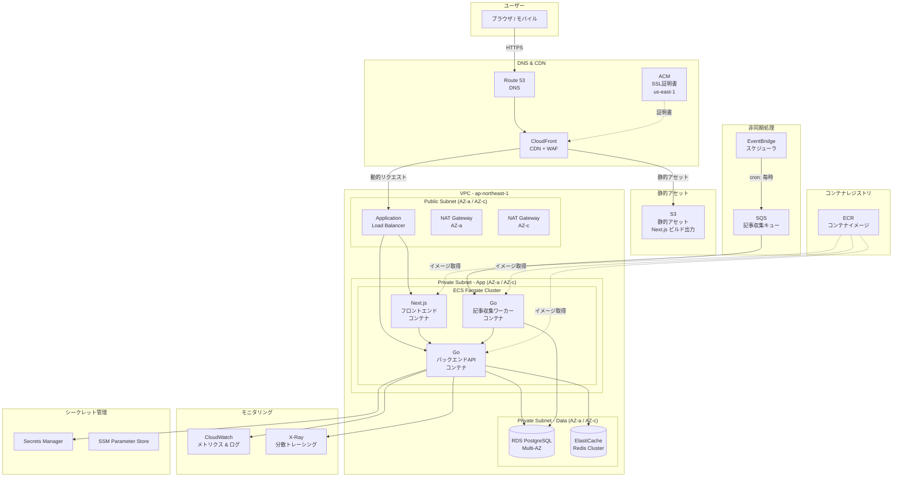
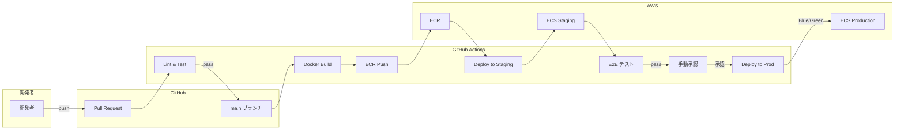

# ClaudeCode記事プラットフォーム - AWSインフラ設計書

## 1. 設計方針

### 1.1 基本原則

| 原則 | 説明 |
|------|------|
| **高可用性** | Multi-AZ構成、ECS Fargateによるコンテナオーケストレーション、ALBによるヘルスチェック |
| **コスト最適化** | Fargate Spotの活用、CloudFrontキャッシュによるオリジン負荷削減、RDS Reserved Instance |
| **セキュリティ** | WAFによるL7防御、IAM最小権限、Secrets Managerによるシークレット管理、VPC内通信の暗号化 |
| **運用性** | IaCによる環境構築自動化、CI/CDパイプライン、CloudWatch/X-Rayによる可観測性 |
| **スケーラビリティ** | ECS Auto Scaling、CloudFront CDN、ElastiCacheによる読み取り負荷分散 |

---

## 2. 全体構成図



---

## 3. AWSサービス選定理由と設定概要

### 3.1 コンピューティング

| サービス | 選定理由 | 設定概要 |
|----------|----------|----------|
| **ECS Fargate** | サーバーレスコンテナでインフラ管理不要。スケーリングが容易。EC2と比較して運用コスト削減 | タスク定義でCPU/メモリ制限、Auto Scaling設定 |
| **ALB** | L7ロードバランシング、パスベースルーティング（`/api/*` → Go, それ以外 → Next.js）| ヘルスチェック間隔30秒、ターゲットグループ2つ |

### 3.2 ストレージ・データベース

| サービス | 選定理由 | 設定概要 |
|----------|----------|----------|
| **RDS PostgreSQL** | リレーショナルデータの保存、Multi-AZで高可用性。記事データのJSON型サポート | エンジン: PostgreSQL 16、インスタンス: db.t4g.medium、ストレージ: gp3 50GB |
| **ElastiCache Redis** | セッション管理、記事キャッシュ、APIレスポンスキャッシュ。低レイテンシ | ノードタイプ: cache.t4g.small、レプリカ1台 |
| **S3** | Next.jsの静的ビルド出力、画像アセットの配信元。CloudFrontと統合 | バケットポリシーでCloudFrontのみアクセス許可、ライフサイクルルール設定 |

### 3.3 ネットワーク・セキュリティ

| サービス | 選定理由 | 設定概要 |
|----------|----------|----------|
| **Route 53** | DNSマネージドサービス、ヘルスチェック連携、エイリアスレコード | CloudFrontへのエイリアスレコード |
| **CloudFront** | グローバルCDN、S3オリジンの保護、HTTPS終端 | キャッシュポリシー: 静的アセット24h、動的コンテンツはパススルー |
| **ACM** | SSL/TLS証明書の自動更新 | CloudFront用（us-east-1）、ALB用（ap-northeast-1） |
| **WAF** | SQLインジェクション/XSS対策、レートリミット | AWSマネージドルール + カスタムレートリミット（1000req/5min per IP） |

### 3.4 非同期処理・イベント

| サービス | 選定理由 | 設定概要 |
|----------|----------|----------|
| **SQS** | 記事収集タスクのキューイング、リトライ制御、DLQ対応 | 可視性タイムアウト: 300秒、DLQ: 最大受信3回 |
| **EventBridge** | cron式スケジューリング、Lambda不要でSQSへ直接送信 | ルール: `rate(1 hour)` で記事収集トリガー |

### 3.5 CI/CD・コンテナ

| サービス | 選定理由 | 設定概要 |
|----------|----------|----------|
| **ECR** | AWSネイティブのコンテナレジストリ、ECSとシームレスに統合 | ライフサイクルポリシー: 最新10イメージ保持 |

---

## 4. VPC設計

### 4.1 ネットワーク構成

```
VPC CIDR: 10.0.0.0/16

┌─────────────────────────────────────────────────────────────┐
│ VPC: 10.0.0.0/16                                            │
│                                                             │
│  AZ-a (ap-northeast-1a)        AZ-c (ap-northeast-1c)      │
│  ┌─────────────────────┐      ┌─────────────────────┐      │
│  │ Public: 10.0.1.0/24 │      │ Public: 10.0.2.0/24 │      │
│  │  - ALB              │      │  - ALB              │      │
│  │  - NAT Gateway      │      │  - NAT Gateway      │      │
│  └─────────────────────┘      └─────────────────────┘      │
│  ┌─────────────────────┐      ┌─────────────────────┐      │
│  │ Private App:        │      │ Private App:        │      │
│  │   10.0.11.0/24      │      │   10.0.12.0/24      │      │
│  │  - ECS Fargate      │      │  - ECS Fargate      │      │
│  └─────────────────────┘      └─────────────────────┘      │
│  ┌─────────────────────┐      ┌─────────────────────┐      │
│  │ Private Data:       │      │ Private Data:       │      │
│  │   10.0.21.0/24      │      │   10.0.22.0/24      │      │
│  │  - RDS              │      │  - RDS (Standby)    │      │
│  │  - ElastiCache      │      │  - ElastiCache      │      │
│  └─────────────────────┘      └─────────────────────┘      │
└─────────────────────────────────────────────────────────────┘
```

### 4.2 セキュリティグループ設計

| セキュリティグループ | インバウンド | アウトバウンド |
|----------------------|-------------|---------------|
| **sg-alb** | 80/443 from 0.0.0.0/0 (CloudFront IP範囲に限定推奨) | ECS SG へ 3000, 8080 |
| **sg-ecs-frontend** | 3000 from sg-alb | sg-ecs-backend:8080, 443 (外部API) |
| **sg-ecs-backend** | 8080 from sg-alb, sg-ecs-frontend | sg-rds:5432, sg-redis:6379, 443 |
| **sg-ecs-worker** | なし（アウトバウンドのみ） | sg-rds:5432, 443 (SQS/外部API) |
| **sg-rds** | 5432 from sg-ecs-backend, sg-ecs-worker | なし |
| **sg-redis** | 6379 from sg-ecs-backend | なし |

---

## 5. CI/CDパイプライン



### 5.1 デプロイ戦略

- **Blue/Green Deploy**: ECS + CodeDeployによるゼロダウンタイムデプロイ
- **ロールバック**: CodeDeployの自動ロールバック（CloudWatchアラーム連動）
- **カナリアリリース**: 本番トラフィックの10%を新バージョンに5分間ルーティング → 問題なければ100%切替

### 5.2 ブランチ戦略

| ブランチ | デプロイ先 | トリガー |
|----------|-----------|----------|
| `feature/*` | - | PR作成時にLint & Test |
| `develop` | dev環境 | pushで自動デプロイ |
| `main` | staging → prod | staging自動 → prod手動承認 |

---

## 6. 環境分離

### 6.1 環境構成

| 環境 | 用途 | AWSアカウント | 構成差分 |
|------|------|--------------|----------|
| **dev** | 開発・検証 | 開発アカウント | Fargate 最小構成、RDS Single-AZ db.t4g.micro |
| **staging** | リリース前検証 | ステージングアカウント | 本番相当構成（スケール縮小） |
| **prod** | 本番 | 本番アカウント | フルスケール構成、Multi-AZ |

### 6.2 アカウント戦略

- AWS Organizationsでマルチアカウント管理
- 各環境はIaC（Terraform）で同一コードから異なるパラメータでデプロイ
- 環境変数・シークレットは各アカウントのSecrets Managerで個別管理

---

## 7. モニタリング設計

### 7.1 CloudWatch

| 対象 | メトリクス | アラーム閾値 |
|------|-----------|-------------|
| **ECS** | CPU使用率、メモリ使用率、タスク数 | CPU > 80% 5分間、メモリ > 85% |
| **ALB** | リクエスト数、5xx率、レイテンシ | 5xx率 > 1% 5分間、P99レイテンシ > 3秒 |
| **RDS** | CPU使用率、接続数、レプリカラグ | CPU > 80%、接続数 > 80% |
| **SQS** | キュー深度、メッセージ滞留時間 | DLQメッセージ数 > 0 |
| **Redis** | メモリ使用率、キャッシュヒット率 | メモリ > 80%、ヒット率 < 90% |

### 7.2 ログ管理

- **CloudWatch Logs**: ECSコンテナログ、ALBアクセスログ
- **ログ保持期間**: dev 7日、staging 30日、prod 90日
- **構造化ログ**: JSON形式でCloudWatch Logs Insightsによるクエリ対応

### 7.3 X-Ray（分散トレーシング）

- Go バックエンドにX-Ray SDKを組み込み
- APIリクエスト → DB/Redis/SQS のトレースを可視化
- レイテンシボトルネックの特定に活用

### 7.4 ダッシュボード

CloudWatch Dashboardに以下を集約:
- リクエスト数・エラー率のリアルタイムグラフ
- ECSタスク数・CPU/メモリの推移
- RDS/Redis のパフォーマンス指標
- SQSキュー深度・処理速度

---

## 8. コスト見積もり

### 8.1 最小構成（dev環境）- 月額概算

| サービス | 構成 | 月額 (USD) |
|----------|------|-----------|
| ECS Fargate | 0.25 vCPU / 0.5GB x 2タスク | ~$15 |
| RDS PostgreSQL | db.t4g.micro, Single-AZ, 20GB | ~$15 |
| ElastiCache Redis | cache.t4g.micro | ~$12 |
| ALB | 1台 | ~$18 |
| S3 + CloudFront | 10GB + 100GB転送 | ~$5 |
| Route 53 | 1ホストゾーン | ~$1 |
| NAT Gateway | 1台 | ~$35 |
| その他（CloudWatch, ECR等） | - | ~$10 |
| **合計** | | **~$111/月** |

### 8.2 本番構成（prod環境）- 月額概算

| サービス | 構成 | 月額 (USD) |
|----------|------|-----------|
| ECS Fargate | 0.5 vCPU / 1GB x 4タスク（Frontend 2 + Backend 2） + Worker 1 | ~$75 |
| RDS PostgreSQL | db.t4g.medium, Multi-AZ, 50GB gp3 | ~$140 |
| ElastiCache Redis | cache.t4g.small, レプリカ1台 | ~$50 |
| ALB | 1台 | ~$25 |
| S3 + CloudFront | 50GB + 500GB転送 | ~$20 |
| Route 53 | 1ホストゾーン + ヘルスチェック | ~$3 |
| NAT Gateway | 2台（Multi-AZ） | ~$70 |
| WAF | Web ACL + マネージドルール | ~$15 |
| Secrets Manager | 5シークレット | ~$3 |
| CloudWatch | ログ・メトリクス・ダッシュボード | ~$20 |
| ECR | イメージ保存 | ~$5 |
| **合計** | | **~$426/月** |

### 8.3 コスト最適化施策

- **Fargate Spot**: ワーカータスクにSpotを活用（最大70%コスト削減）
- **RDS Reserved Instance**: 1年予約で最大40%削減
- **CloudFront キャッシュ**: オリジンリクエスト削減でFargate/ALBコスト抑制
- **NAT Gateway 代替**: dev環境ではVPCエンドポイント活用でNAT Gateway削減検討

---

## 9. セキュリティ設計

### 9.1 IAMロール設計（最小権限の原則）

| ロール | 付与先 | 権限概要 |
|--------|--------|----------|
| **ecsTaskExecutionRole** | ECSタスク起動 | ECRプル、CloudWatch Logs書き込み、Secrets Manager読み取り |
| **ecsTaskRole-frontend** | Next.jsコンテナ | S3読み取り（アセット取得）のみ |
| **ecsTaskRole-backend** | GoバックエンドAPI | RDS接続、Redis接続、SQS送信、X-Ray書き込み |
| **ecsTaskRole-worker** | Go記事収集ワーカー | RDS接続、SQS受信/削除、外部API呼び出し |
| **github-actions-role** | CI/CD（OIDC連携） | ECRプッシュ、ECSデプロイ、CodeDeploy操作 |

### 9.2 シークレット管理

| シークレット | 管理先 | 用途 |
|-------------|--------|------|
| DB接続文字列 | Secrets Manager | RDS PostgreSQL接続 |
| Redis接続文字列 | Secrets Manager | ElastiCache接続 |
| 外部APIキー | Secrets Manager | 記事収集API認証 |
| アプリ設定値 | SSM Parameter Store | 機能フラグ、設定値 |

### 9.3 ネットワークセキュリティ

- データベース/キャッシュはプライベートサブネットに配置（インターネットアクセス不可）
- ECSタスクはNAT Gateway経由でのみ外部通信
- VPCエンドポイント（Gateway型: S3、Interface型: ECR, CloudWatch Logs, Secrets Manager, SQS）で内部通信をAWSバックボーンに閉じる
- ALBへのアクセスはCloudFrontのマネージドプレフィックスリストで制限

### 9.4 データ保護

- RDS: 保存時暗号化（AES-256）、転送時暗号化（SSL/TLS）
- S3: SSE-S3によるサーバーサイド暗号化、バケットポリシーでパブリックアクセスブロック
- ElastiCache: 転送時暗号化、保存時暗号化有効化

---

## 10. IaCツール方針

### 10.1 Terraform採用

**選定理由**:
- マルチクラウド対応の知見が広く、コミュニティが大きい
- HCLによる宣言的記述で可読性が高い
- `terraform plan` による変更差分の事前確認が容易
- モジュール化による環境間（dev/staging/prod）のコード共有

### 10.2 ディレクトリ構成

```
infra/
├── modules/
│   ├── networking/       # VPC, Subnet, SG, NAT
│   ├── ecs/              # ECS Cluster, Service, Task Definition
│   ├── rds/              # RDS Instance, Subnet Group
│   ├── elasticache/      # Redis Cluster
│   ├── cdn/              # CloudFront, S3, ACM
│   ├── messaging/        # SQS, EventBridge
│   ├── monitoring/       # CloudWatch, X-Ray
│   └── security/         # IAM, WAF, Secrets Manager
├── environments/
│   ├── dev/
│   │   ├── main.tf
│   │   ├── variables.tf
│   │   └── terraform.tfvars
│   ├── staging/
│   │   ├── main.tf
│   │   ├── variables.tf
│   │   └── terraform.tfvars
│   └── prod/
│       ├── main.tf
│       ├── variables.tf
│       └── terraform.tfvars
└── backend.tf            # S3 + DynamoDB によるステート管理
```

### 10.3 ステート管理

- **バックエンド**: S3バケット + DynamoDBテーブルによるリモートステート & ロック
- **環境ごとにステートファイルを分離**: `s3://project-tfstate/{env}/terraform.tfstate`
- **ステートファイルのバージョニング**: S3バケットのバージョニング有効化

---

## 11. 将来の拡張ポイント

| 項目 | 概要 |
|------|------|
| **全文検索** | Amazon OpenSearch Service 追加による記事全文検索 |
| **CDN最適化** | CloudFront Functions / Lambda@Edge による画像最適化 |
| **マイクロサービス化** | 記事収集サービスの独立化、API Gateway + Lambda への移行検討 |
| **データ分析** | Kinesis Data Firehose → S3 → Athena によるアクセスログ分析 |
